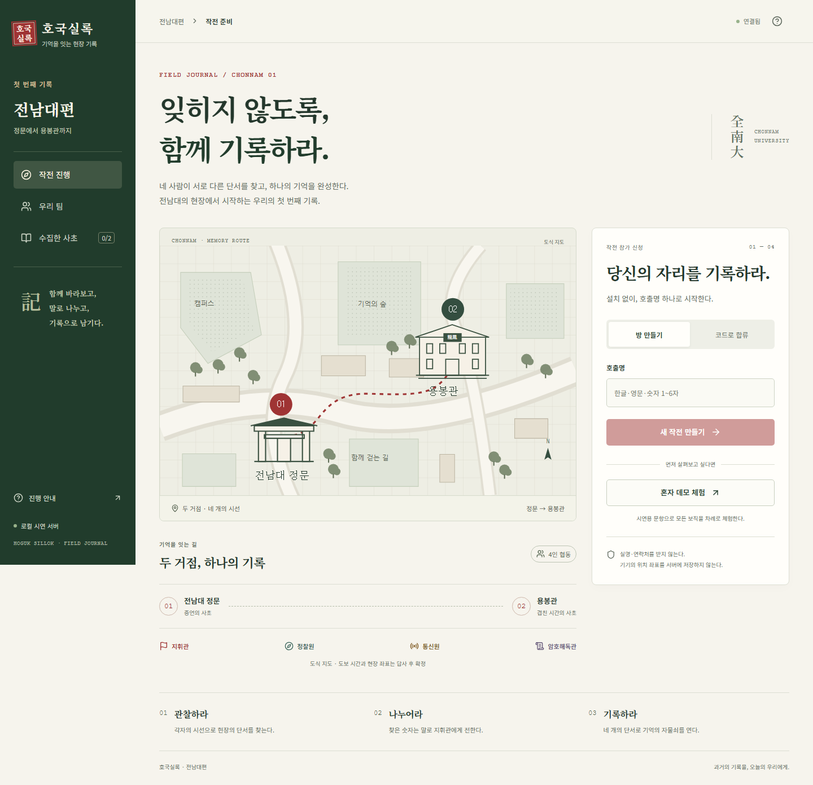
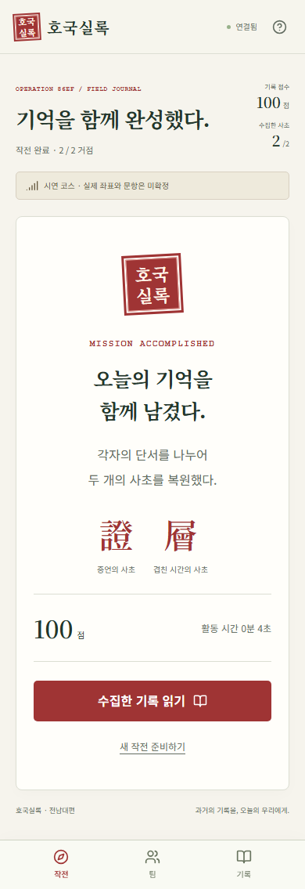
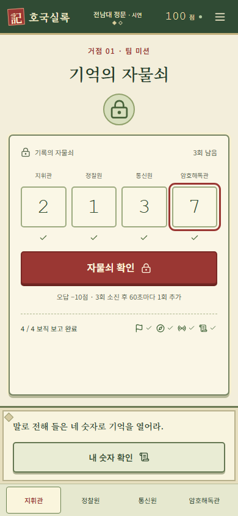
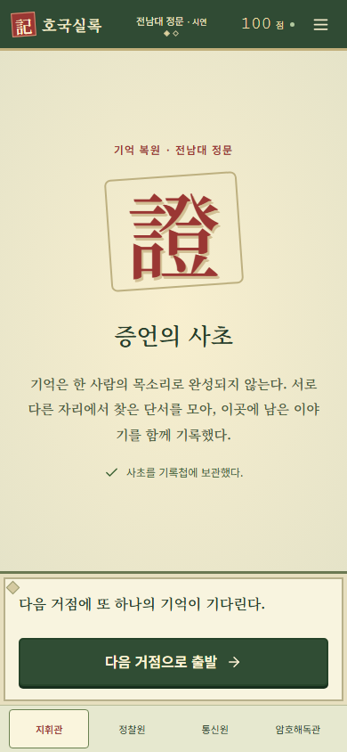
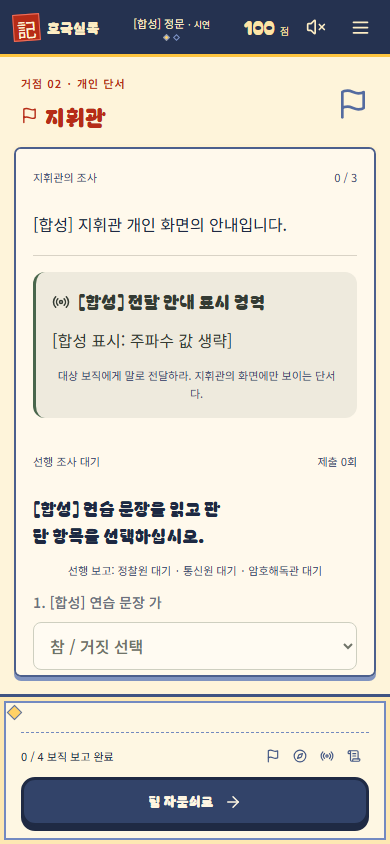

# 웹앱 구현·검증 기록

## 2026-10-09 PR-4 용봉관

- 정문→용봉관 이동·새 전원 도착, 역할별 11단계, 통신원 기록의 암호해독관 전용 전달, 기록 없는 해설 경로, 반복 분류 선택, 외부 대체 모드, 사초②와 재접속 복구를 구현했다.
- `npm test`: 32파일 321개 통과. 신규 용봉관 엔진·시드 8개와 DB 2개를 포함한다. 자료 비공개 범위·종속성·시드 검증, 모드 전환의 기존 기록·감점·시도 보존·멱등, CAS 경합·이벤트 거절을 확인했다.
- `npm run typecheck`, `npm run build` 통과. Edge `deno check --no-lock` 및 CI 대상 v2 공유 모듈 13개의 `deno lint` 통과.
- `playwright.yongbong.config.ts`: 합성 4세션 시나리오 1개 통과. 메인 화면의 용봉관 출발·외부 대체 모드·분류 입력, 역할별 기록 분리, 새로고침·기록첩, 360/390/430px 가로 넘침을 확인했다. 명시적 `YONGBONG_CAPTURE=1` 옵션으로 [합성 외부 모드 화면](../../docs/fe/images/yongbong-outdoor-synthetic.png)을 캡처했다. 실제 시나리오 화면·자료는 캡처하지 않았다.
- 실제 원문 등록 준비는 ignored private 폴더에서만 수행했다. 스키마 검토용 메모리 복사본에서 7개 정답 형태를 검사했고 1개 연결을 미확정으로 남겼다. 운영 등록 차단을 확인했으며 실제 정답·본문을 테스트·커밋에 넣지 않았다.
- **미수행:** Supabase 새 마이그레이션 적용·Edge 배포·코스 등록·Vercel 배포, 휴대폰 4대 현장 GPS 완주, 실제 사진·공식 자료 검수. [적용 안내](../../docs/be/YONGBONG_APPLY.md) 참고. 이전 정문 전용 기록은 당시 검증 이력이다.

## 2026-10-09 GPS 통합본 dev 배포 후 확인

- Vercel dev 별칭 `https://hoguk-dev-web.vercel.app/`에 코드 `76550a5` 배포 완료. 배포 ID는 `dpl_8t9gAhzRr3uc75L4dm7JSLGWP4qS`이며 Ready 상태와 별칭 연결을 확인했다. 아래 구현 당시의 미배포 기록 이후 수행한 작업이다.
- `/`, `/verify` HTTP 200, 배포 JS의 새 GPS 화면 문구·예상 dev Supabase 호스트, 위치 권한 정책을 확인했다. 클라우드 `/api/game`의 로컬 게임 경로는 403 `LOCAL_DISABLED`로 차단됨을 확인했다.
- 브라우저 자동화 도구의 Windows 초기화 오류로 배포 후 화면 시각 검사는 수행하지 못했다. HTTP·정적 자산 확인을 네 기기 현장 시험이나 클라우드 정문 완주로 보지 않는다.
- GPS 코스 등록·Edge 최초 준비는 사용자 완료 보고 기준이다. 현재 `ACTIVE_COURSE_ID`를 읽거나 변경하지 않았다. 같은 웹에서 개발용/GPS 코스를 번갈아 확인하는 절차는 [GPS 적용 안내](../../docs/be/GPS_APPLY.md)에 기록했다.
- PR 제출 전 문서 보완 후 `npm test` 31개 파일·311개, `npm run typecheck`, CI 대상 공유 모듈 11개의 Deno lint를 다시 통과했다. 수정 문서 5개의 로컬 링크, GPS 안내의 PowerShell 코드 블록 5개 문법, `git diff --check`도 확인했다. 웹·Edge 코드는 기존 GPS 검증 시점과 같다.

## 2026-10-09 GPS 필수 도착과 반경 10m

- 세 목표 좌표를 `jnu-gps.ts`에 보관하고 정문 공개 코스 및 새 dev `v1-gate-gps` preset에 연결했다. 목표 지정은 사용자 승인이고 4대 실기기 현장 시험은 미수행이다. 후속 용봉관·봉지 미션은 아직 연결하지 않았다.
- `npm test`: 31개 파일, 311개 테스트 통과. 신규 7개 테스트에서 전원 도착 전 문제·힌트·보고·개방 차단, 본인만 도착, 멱등성, 역할·도착 복원, 수동·QR·모의 우회 거절, 설정 오류, 9m/11m 경계, dev seed와 prod 차단을 검증했다.
- `npm run typecheck`, `npm run build`: 통과. Edge `deno check --no-lock supabase/functions/game/index.ts`와 변경된 공통 모듈 5개 `deno lint`: 통과.
- `npx playwright test --config playwright.gps.config.ts`: 1개 네 세션 시나리오 통과(2.1분). 외부 위치·accuracy 41m·10초 지난 위치·권한 거부에서 도착 요청 0건, 3명 도착 시 전원 대기, 네 번째 GPS 도착 후 네 화면에서 미션 공개, 각자 도착 요청 1회, 재접속 역할·도착 보존, 사용자 좌표 미전송을 확인했다. 위치 입력은 브라우저 합성이며 실제 현장 측위 시험이 아니다.
- 새 테스트는 실제 시나리오 정답·비밀값·원시 GPS CSV를 사용하지 않는다. 공개 이동 화면만 제외 폴더 `.demo-data/gps-travel-public.png`에 캡처해 390px 표시를 검토했다. 개인 미션·응답은 캡처·trace·video로 저장하지 않았다.
- 보조 FE lint에는 Next.js 확장자 없는 import·브라우저 window·기존 버튼 type 관례에 맞지 않는 Deno 규칙을 제외했다(`no-sloppy-imports,no-window,no-window-prefix,jsx-button-has-type`). 초기 실행의 환경 규칙 오류와 테스트 블록 내부 함수 선언 지적을 확인하고, 후자는 화살표 함수로 수정했다. 저장소 CI의 Edge lint 규칙은 완화하지 않았다.
- 새 DB 마이그레이션 없음. 클라우드 코스 등록·Edge·Vercel 배포는 실행하지 않았다. 새 불변 코스 리비전 및 새 방이 필요하며 [적용 안내](../../docs/be/GPS_APPLY.md)를 따른다.

## 2026-10-09: 기존 v1 정문의 임시 v2 이관

`feat/ui-v2-integration`에서 기존 v1 원본을 공유하는 `v1-gate` preset을 추가했다. 현장 확정 코스가 아니며 [적용 안내](../../docs/be/LEGACY_GATE_DEV.md)대로 별도 dev 리비전으로 등록한다.

- `npm test`: **29개 파일, 300개 테스트 통과**. 신규 7개는 문항·선택지·숫자 재사용, 요일→선택 번호 변환, 리비전/salt 해시 분리, 네 역할 정상 개방, 힌트/해설 전후 주파수 격리, 별도 해설 개방 조건, seed preset과 dev 허용 검사를 포함한다.
- `npm run typecheck`, `npm run build` 통과. 신규 변환 모듈 Deno check 및 기존 factory·신규 모듈 Deno lint 통과. npm lint 스크립트는 없다.
- `npx playwright test --config playwright.legacy.config.ts`: **1개 통과(1.2분)**. 네 독립 브라우저 세션에서 메인 UI 입장·보직·준비·도착·각 역할 한 문제·별도 보고·자물쇠·새로고침 완료 복구를 확인했다. 앞선 실행은 출발 뒤 이동 HUD 등장 대기 10초에서 실패했고, 샌드박스의 서버 종료 지연도 있었다. 테스트 서버를 정리한 뒤 개인 값 없는 실패 진단을 추가하고 프로세스 정리가 가능한 환경에서 재실행해 통과했다. HUD 대기 설정과 제품 코드는 그대로이며 최초 시간 초과 원인은 확정하지 못했다. 실기기 성능 측정으로 보지 않는다. trace·캡처·동영상과 개인 응답은 보관하지 않는다.
- 기존 v1 데이터 블록은 기준 커밋 `39526ed`와 줄바꿈을 정규화해 비교했고 동일했다. 신규 변환 함수·입력 함수·개인 장면 표식이 production 클라이언트 JS에 포함되지 않음을 확인했다.
- 문서 링크와 `git diff --check` 통과. 읽기 전용 독립 검토에서 차단할 결함은 발견하지 못했다. 기본 정문 시나리오와 달리 지휘관 문제를 병렬로 푸는 preset 예외는 API 계약에 명시했다.
- 이 preset의 Supabase 등록·활성 코스 전환은 아직 수행하지 않았다. 실제 클라우드 네 기기·현장 검증과 구분한다. 기존 마이그레이션·Edge 판정·UI API 형식은 변경하지 않는다.

아래는 이전 구현·검증 기록이다. 기준: 2026-10-06 한국시간, 작업 브랜치 `codex/jnu-web-demo`. Next.js 16.3.8, React 19.3.0, Node 24.15.0, Supabase JS 2.117.2. 모든 실행은 합성 코스와 로컬 환경이다.

## 구현 범위

F01~F11의 방·QR·4인 보직·준비·도착·역할 미션·보고·자물쇠·사초·종료·복구와 서버 권한 구조를 구현했다. F12의 로컬 검증과 배포 설정을 준비했으며 외부 운영 배포는 수행하지 않았다. 원본 데모·논문·원시 GPS를 변경하거나 새로 업로드하지 않았다.

## 실행된 검증

- Vitest: GPS 3표본/5초·오차/공백/이탈/유효성, 역할·게임 접근, 수동도착30초, 단서 조회 단계·거점, 자물쇠3회/60초/추가1회/중복감점, 호출명/슬롯 제한, 답 정규화, 시드 미확정 값 거절.
- PostgreSQL/PGlite: SQL 마이그레이션 실행, private table/RPC 접근 거절, 멤버의 자기 팀 투영만 조회, CAS stale update 거절, public/private atomic commit, 생성 receipt 중복/충돌, 합류5회 차단.
- Playwright API: 4개 독립 세션·동시 마지막 합류·다섯째 거절, 역할4종, 준비/출발, 30초 이전 수동도착 거절, 두 거점 완주, 개인 숫자/잠금 복구, 동시 재전송 감점1회, 종료 후 변경 거절.
- Playwright UI: 모바일 실제 클릭으로 혼자 체험의 4역할·두 거점 완주, 매 미션 뒤 새로고침 숫자 복구, 360/390/430/768px 가로 넘침 없음, 첫 화면 WCAG A/AA 자동 검사, 1440px/390px 캡처.
- 비동기 회귀: 최종 변경 응답 지연→조회로 먼저 종료→새 작전 준비→늦은 응답이 홈 화면을 되돌리지 않음. 초기 연결 실패 안내와 재연결 후 안내 해제.
- 네 개의 독립 브라우저 창: 방 생성·QR 경로 합류·무작위 보직 공개·위치 거부 후 준비·지휘관 출발·30초 수동 도착·역할별 UI 미션·두 거점 자물쇠·사초2개 동기화 시험. 최종 실행 결과는 PR에 기록한다.
- `npm run typecheck`, `npm run build`, Deno `check`로 Next와 Edge 함수 검증.
- npm 의존성 감사: Vitest의 확인된 취약점을 4.1.11로 갱신했다. 최종 재검사 결과는 PR에 기록한다.
- 독립 코드 리뷰: 보직 공개 종료 조회, 코스 리비전 생성 재전송, 진행 중 조회 알림 유실, 늦은 변경 응답의 화면 복귀를 수정했다. 연결 오류 배너 복구도 회귀 시험으로 확인했다.

## 아직 실행하지 않은 검증

- 실제 Supabase 프로젝트의 익명 인증·Edge 배포·Realtime 구독과 채널 정책.
- 실제 폰 4대의 iOS Safari·Android Chrome 완주와 현장 네트워크 지연 측정.
- 답사 좌표·반경·문항 확정, 실측 GPS CSV와 원본 판정기 교차 검증.
- Vercel HTTPS 운영 배포, 외부 클라우드 사용 승인·계정 명의·보관 정책 확정.
- 교육 효과, 현장 성공률, 1초 이내 실시간 동기화 달성.

브라우저/합성 시험 성공을 실기기·현장 시험 성공이나 논문 평가 결과로 쓰지 않는다.

## 작업 후반 추가 확인한 GPS 원본

작업 중 루트 `index.html`·`analyze_gps.py`와 `GPS/` 자료가 추가되어 읽기 전용으로 확인했다. 원본 `judgeState`/`smoothed_track`은 3개가 모이기 전에도 부분 창으로 평균을 계산하고, 고오차 표본을 제외한 뒤 체류를 이어 가며, 측위 공백의 상한이 없다. 앱은 개정 PRD에 따라 유효 표본3개부터 시작하고 고오차·5초 초과 공백을 보수적으로 초기화한다.

따라서 원본과 완전히 같은 결과라고 보고하지 않는다. G01 회의에서 세 구현의 표본 준비·오차·공백 규칙을 통일하고 실제 CSV를 교차 검증해야 한다. 원본 도구를 임의로 수정·커밋하지 않았다.

## 최종 실행 결과

- 단위/DB 테스트: 4개 파일, 16개 통과.
- 전체 Playwright: API·응답 지연·연결 복구·네 브라우저 창 완주·모바일 혼자 체험, 5개 통과(2.7분).
- 독립 작업 공간의 배포 빌드: 빌드/타입/Edge 검사 통과. production 서버에서 UI/복구 3개 재확인 통과.
- 클라이언트 번들에 서버 답 모듈·해시·시연 주파수 단서가 포함되지 않음을 확인.
- 전체 의존성 감사: 취약점 0개.
- 독립 최종 리뷰: 미해결 Critical/Important 없음.

## 화면 단위 게임 UI 개편

2026-10-06 사용자 피드백 반영: 사이드바·소개 페이지를 게임 캔버스로 교체했다. 타이틀·입장·로비·보직·장비·이동·미션·숫자 획득·자물쇠·사초·종료를 한 장면씩 표시하고, 팀·기록·안내는 모달에서 연다. 전체 페이지를 스크롤하지 않고 모바일 화면 높이에 맞춘다. 서버 규칙과 개인 응답 분리를 유지한다.

- 단위/DB 테스트16개·타입·빌드 통과.
- 전체 브라우저 시험6개 통과: 네 창 두 거점 완주, 모바일 체험, 숫자/자물쇠 별도 장면, 페이지 높이, 메뉴 Escape, 응답 지연과 연결 복구 포함.
- 실제 production 주소3001의 UI/복구4개 재검증 통과.
- 독립 읽기 전용 리뷰에 Critical/Important 회귀 없음.
- 아래 이미지는 개편된 장면의 합성 코스 캡처다.

## PR-0: dev 배포 준비와 CI

2026-10-08 한국시간, `infra/deploy-dev`. Node 24.19.0, npm 12.2.0, Deno 2.9.7, Next.js 16.3.8. 아래 결과는 로컬 Windows 환경과 합성 데이터의 검증이다.

- `npm ci` 성공. 이 PC에 npm·Deno가 없어 Git에서 제외된 `private/tools`에 공식 도구를 받아 실행했다. npm 12가 esbuild 설치 스크립트를 기본 차단했으나 아래 테스트·빌드는 통과했다. 앱 의존성·lockfile은 변경하지 않았다.
- `npm run typecheck` 통과.
- `npm test`: 6개 파일, 41개 테스트 통과. CORS 단일·복수 출처 호환, 잘못된 출처 거절, dev opt-in 기본 차단, 실제 코스와 합성 코스 구분, seed 대상 ref·URL·salt 검사, seed salt를 사용하는 네 역할 두 거점 완주·개인 응답 분리·자물쇠 재전송/감점/대기를 포함한다.
- `npm run build` 통과. 저장소 밖 사용자 홈의 lockfile을 무시한다는 Next 경고는 있었으며 빌드는 성공했다.
- `deno check --no-lock supabase/functions/game/index.ts` 통과. 출력: `Check supabase/functions/game/index.ts`.
- 빌드된 클라이언트 chunk에서 `answerHash`, 기존 로컬 전용 salt 표식, dev 허용 변수명이 발견되지 않았다. 이는 실제 프로젝트의 응답 검증을 대신하지 않는다.
- `npm run seed:demo`에 인자를 주지 않으면 사용법을 출력하고 종료 코드 1로 거절함을 확인했다. 실제 Supabase에 seed하지 않았다.
- Playwright: 기존 9개 시나리오 확인. API 1개(네 독립 세션의 두 거점 완주) 통과 후 필요한 Chromium 1243이 없어 UI 8개는 시작 전 실패했다. 해당 브라우저를 Git에서 제외된 도구 폴더에 설치하고 `npm run test:e2e -- --last-failed`로 UI 8개 모두 통과(1.8분)했다. 최초 시도에는 임시 npm launcher의 경로 문제도 있었으며 도구 경로를 보정했다. 샌드박스에서 시험 서버 종료가 지연되어 해당 시험의 서버만 종료했고, UI 재실행은 자식 프로세스 정리가 가능한 환경에서 수행했다. 앱·시험 코드를 바꾸어 실패를 회피하지 않았다.
- 부록 A의 제목 수준 외 원문 일치, `private/` 및 `*.private.local.json` Git 제외를 확인했다. 공통 엔진·기존 마이그레이션·실제 코스 검증기와 seed는 수정하지 않았다.

### 미수행과 후속 확인

- GitHub PR 생성·Actions CI 실행: gh 미로그인으로 브랜치 push 후 사용자가 브라우저에서 PR을 만들어야 한다. 로컬 통과를 GitHub CI 통과로 표시하지 않는다.
- Supabase dev 생성·설정·DB 적용·실제 seed·Edge 배포·익명 인증/Realtime/RLS 서비스 검증.
- Vercel 배포·실제 Preview 출처·폰 4대 시험·현장 GPS 시험. 담당자가 [DEPLOY.md](../../docs/be/DEPLOY.md)의 체크리스트를 수행하고 PR에 별도로 기록한다.
- PR-1 이후 v2 콘텐츠·엔진 기능과 D3·D6 확정 이후 PR-6은 이번 검증 범위에 포함하지 않는다.

## PR-1: 코스 v2 스키마·정문 콘텐츠·API 계약

2026-10-08 한국시간, `feat/course-v2-schema` (`infra/deploy-dev` 위에 생성). Node 24.19.0 / npm 12.2.0 / Deno 2.9.7, 로컬 Windows와 합성 데이터로 확인했다.

- `npm test`: 7개 파일, **79개 통과**. 기존 41개와 신규 38개. NFC·공백·선택 번호·주파수·집합/순열/매핑 해시, salt/courseId/stepId 구분, 역할 누락·중복 ID·선행/보고 순환, 힌트 개수·좌표·점수·사진·근거 문항 미확정 거절, 비공개 자료 TODO·필수 항목 일치 검사를 포함한다.
- 지휘관 전달형 주파수는 지휘관 self에만 들어가고 다른 세 역할 및 공개 투영에는 들어가지 않는다. 직렬화한 응답에서 해시·미해제 힌트/해설/보상·완료 숫자를 검사했다. 저장 객체에 허용되지 않은 필드가 추가된 경우도 투영에서 제외했다.
- `npm run typecheck`, `npm run build` 통과. 마지막 코드 보강 후 다시 통과했다. 저장소 밖 홈 lockfile 무시 경고는 있었으며 빌드는 성공했다.
- `deno check --no-lock supabase/functions/game/index.ts supabase/functions/_shared/prepare-seed-course.ts supabase/functions/_shared/project-course-v2.ts` 통과. CI도 아직 엔진에서 import하지 않는 v2 모듈을 검사하도록 확장했다.
- `npm run test:e2e`: 기존 Playwright **9개 모두 통과(3.0분)**. 네 독립 API 세션·네 브라우저 창 두 거점 완주, 자물쇠 초안 유지, 재접속/응답 지연, 모바일 합성 데모 포함. 실제 폰 시험이나 수동 현장 시험이 아니다.
- `seed:course --validate-only`에 저장소의 v2 공개 초안과 합성 private 예시를 전달하자 `운영 코스 confirmed=true 확정이 필요하다`로 종료 코드 1을 반환했다. 의도된 거절이며 DB 등록을 하지 않았다. 검증용 salt는 실행 시 임시 생성했다.
- 클라이언트 `.next/static/chunks`에서 `relay-frequency`, `transfer_clue`, `answerHashV2`, 합성 비공개 낱말·해설 표식이 발견되지 않았다. 실제 서비스의 응답 격리 시험을 대신하지 않는다.
- `git diff --check` 통과. 시나리오 원문과 `*.private.local.json`의 Git 제외 및 추적 파일에 비공개 원문이 없음을 확인했다.

### 검증 중 수정과 미수행

- 첫 신규 테스트 실행에서 동기 throw를 Promise 거절로 검사한 라우팅 함수 테스트가 실패했다. seed 라우팅 함수의 비동기 계약을 통일한 뒤 전체 테스트가 통과했다. TypeScript/Deno에서 발견한 never 함수의 제어 흐름 추론·JSON 튜플 캐스팅 오류도 수정했다.
- PR-1에는 엔진 액션 연결·새 마이그레이션·DB 적용·클라우드 seed·Supabase/Vercel 배포가 없다. get-stage/submit-step/request-hint의 실제 HTTP 시험은 PR-2에서 수행한다.
- GitHub Actions 실행·실기기 4대·현장 GPS·사진 사용 권한·역사 콘텐츠 현장 대조를 수행하지 않았다. gh 미로그인 절차에 따라 브랜치를 push하고 PR은 사용자가 생성한다.
- 사용자 결정대로 역할별 힌트 3단계를 유지하고 G-01 근거 선택지·짝은 미확정으로 남겼다. 좌표·D5 수치·사진·실제 비공개 값도 운영 투입 전 확정해야 한다. 역할 힌트 3단계의 다단계 해설 범위는 PR-2에서 확인한다.

## 메인 UI와 정문 v2 통합

2026-10-09 한국시간, `feat/ui-v2-integration`. PR #8 `14c105f`의 디자인과 PR #9 `8441e76`의 정문 엔진을 연결했다. 아래 결과는 로컬 Windows와 합성 데이터의 자동 시험이며 클라우드 적용·실기기 시험 결과가 아니다.

- `npm test`: **28개 파일, 293개 통과**. PR-2 엔진·API·DB 검증과 기존 v1 검증을 함께 실행했다.
- `npm run typecheck` 통과. Deno `check`로 Edge 진입점·seed·v2 투영을 검사했고, CI의 v2 공유 모듈 7개와 새 미션 컴포넌트의 Deno lint도 통과했다. Next의 확장자 없는 import는 컴포넌트 lint에서 `no-sloppy-imports`만 제외했다. 별도 `npm run lint` 스크립트는 없다.
- 최종 `npm run build` 통과. `/`, `/j/[code]`, `/verify`, `/api/game`을 생성했고 TypeScript 검사도 통과했다. 최종 클라이언트 chunk에서 `answerHashV2`, `DEV_ALLOW_SYNTHETIC_COURSE`, `privateInput`, `courses_private`, `ANSWER_SALT`가 발견되지 않았다. 실제 배포 응답 격리 시험을 대신하지 않는다.
- 메인 UI 통합 E2E `integrated-v2.spec.ts`: **2개 통과(2.8분)**. 독립 세션 네 개로 입장·보직·준비·각자 도착·문제 제출·별도 보고·일반 자물쇠와 해설 개방을 확인했다. 역할별 정보 격리, 부분 잠금 복구, 응답 유실 시 동일 요청 재시도·중복 감점 방지, 조회보다 늦게 도착한 개방 응답의 완료 문구 유지, 저장소·콘솔 노출도 검사했다.
- 공개 fixture 배치 시험 `integrated-v2-layout.spec.ts`: **5개 통과(38.1초)**. 네 역할의 360·390·430px 가로 넘침·폼 스크롤과 폰 목업 전환을 확인했다. 입력 중인 v2 숫자는 보기 전환에도 저장·복구하지 않는다.
- 기존 `/verify` E2E `npm run test:e2e:v2`: **2개 통과(52.4초)**.
- 기존 v1 E2E: 최초 실행에서 **26개 통과·1개 실패(5.2분)**. 네 창 시험이 수동 도착 버튼 클릭 대기에서 시간 초과했다. 해당 시험을 코드 변경 없이 단독 재실행하여 두 거점 완주까지 통과했다(2.0분). 최종적으로 27개 모두 통과 결과를 얻었으나 최초 실행의 클릭 불안정성은 남겨 둔다. 첫 화면 접근성·반응형, 혼자 체험, 폰 목업·다이얼·소리·재접속·늦은 응답 회귀를 포함한다.
- 개인 응답을 사용하는 신규 통합 시험은 trace·자동 화면 캡처·동영상을 저장하지 않는다. 아래 화면은 정답·비공개 값 없는 공개 문서 fixture만 사용했다.

### 확인 과정과 남은 검증

- 이 PC의 기존 Chromium 설치 경로를 `PLAYWRIGHT_BROWSERS_PATH`로 지정했다. 신규 통합 시험의 SPA 버튼은 실제 API 응답과 화면 상태를 기다리며, Chromium의 무관한 navigation 대기만 `noWaitAfter`로 제외했다. 강제 클릭이나 앱 판정 우회는 사용하지 않았다.
- 코드·문서 독립 검토에서 중대한 미해결 회귀는 발견되지 않았다. 연결 흐름과 재시도·새로고침의 한계는 [UI 통합 안내](../../docs/fe/UI_INTEGRATION.md)에 기록했다.
- Supabase DB 적용·Edge 배포·코스 등록·Vercel 배포는 수행하지 않았다. 마지막 사용자 보고 이후 PR-2 적용 완료 여부는 확인되지 않았다. 실제 private Realtime, iOS/Android 네 기기, 현장 GPS 검증은 사용자의 dev 적용 후 필요하다.
- 기존 사용자 배포 파일·비밀값·실제 시나리오를 가져오거나 커밋하지 않았다. 새 마이그레이션·환경변수 추가와 PR-3 구현은 없다.

## 기존 v1 정문 입력 UI 재사용

2026-10-09 한국시간, `feat/ui-v2-integration`. 사용자가 요청한 기존 무전기·달력·퀴즈 UI를 dev `v1-gate` 코스에 연결했다. 콘텐츠 이관 커밋 `b5d6d5b` 이후의 웹 변경이며 추가 DB 마이그레이션·Edge 변경은 없다.

- `npm test`: **29개 파일, 300개 통과**. v1 콘텐츠의 v2 변환·역할별 투영·기존 판정 검증을 포함한다.
- 최종 `npm run typecheck`, `npm run build` 통과. 공개 mock 시험에 추가한 타입 선언의 오류를 고친 뒤 다시 확인했다.
- 새 입력 어댑터·공유 달력 컴포넌트의 Deno lint 통과. Next의 확장자 없는 import 규칙에 맞춰 `no-sloppy-imports`만 제외했다. 별도 `npm run lint` 스크립트는 없다.
- `legacy-gate-v2.spec.ts`의 기능 시험 **1개 통과(1.1분)**: 독립 세션 네 개의 입장부터 문제·별도 보고·일반 자물쇠·새로고침 복구까지 확인했다. 역할별 360·390·430px 가로 넘침, 선택 버튼·달력·관찰 입력, 무전기 조작, 두 자리 소수의 원문 보존 및 제출 차단, 응답 대기 중 조작 금지를 포함한다. 테스트 통과 출력 후 서버 종료가 지연되어 실행을 중단했으므로 프로세스 전체가 정상 종료한 결과로 기록하지 않는다.
- 빌드된 클라이언트에서 `answerHashV2`, `DEV_ALLOW_SYNTHETIC_COURSE`, `privateInput`, `courses_private`, `ANSWER_SALT`, `legacyDemoV2Input`, `demoCourseInput` 표식이 발견되지 않았다. 클라우드 응답 격리 시험을 대신하지 않는다.
- 추가 공개 mock 배치 시험은 기존 시험 서버의 빌드 디렉터리 잠금으로 시작하지 못했다. 이후 재실행 승인이 거절되어 실행하지 않았다. 추가된 네 역할 mock 시험과 기존 v1 전용 UI 회귀 시험은 이번 변경에서 통과했다고 주장하지 않는다. 개인 응답의 화면·trace·동영상도 저장하지 않았다.
- 독립 코드 검토에서 차단할 결함은 발견하지 못했다. 실제 폰 4대·클라우드 완주·현장 GPS는 미검증이다. 새 legacy 코스의 Supabase 등록·활성화 여부는 사용자 확인이 필요하며, UI 때문에 재등록하거나 salt를 바꾸지 않는다.

## 정문 장면·기록첩·로컬 시연 복원

2026-10-09 한국시간, `feat/ui-v2-integration`. 이전 입력 UI 변경 뒤 숫자 획득·조사/해설 왕복·사초·정문 결과·개인 기록첩·기존 연출을 연결했다. 사용자 결정에 따라 로컬 v2 서버에서도 별도 v1 혼자 체험을 만든다. 아래는 로컬 자동 시험이며 실제 클라우드 적용·폰 4대 시험을 뜻하지 않는다.

- `npm test`: **30개 파일, 304개 통과**. 완료 전 사초/기록첩 비공개, 완료 후 본인 역할 격리, 완료 방식 재조회, 감점·시도 유지, 로컬 v1 시연과 v2 방 분리, 판정 효과음 매핑을 추가 확인했다. 공개 보상 예제 보완 후 API·기록첩 4개 테스트도 다시 통과했다.
- Edge 진입점·legacy seed의 Deno `check` 통과. 변경한 공유 모듈 5개와 기록첩·미션 컴포넌트 2개의 Deno lint 통과. Next 컴포넌트는 `no-sloppy-imports`만 제외했고 별도 npm lint 스크립트는 없다.
- 로컬 자동 시연 시작·정지, 시연 장면 선택·역할 전환, 무전기 마우스·터치, 나레이션, legacy v2 네 세션 완주, 공개 mock의 사초·결과·기록첩 **7개 시나리오 각각 통과**. 네 세션 시험은 숫자 화면↔해설↔자물쇠 왕복, 메모리 초안 유지, 완료 후 재조회까지 포함한다. 공개 mock은 360·390·430px 기록첩 배치를 확인했고 공개 합성 화면을 직접 검토했다.
- 일반 v2 정상 자물쇠·부분 잠금 복구, 전원 해설 확인 후 개방 **2개 시나리오 각각 통과**. 해설 경로는 요청 응답 유실 재시도·중복 감점 방지·세 명 확인 시 개방 거절·늦은 개방 응답·새로고침 후 완료 방식 유지를 포함한다. 도착 클릭의 간헐적 대기는 아래에 별도 기록한다.
- 최종 `npm run typecheck`, `npm run build` 통과. `/`, `/j/[code]`, `/verify`, `/api/game`을 생성했다. 클라이언트 chunk에서 `answerHashV2`, `DEV_ALLOW_SYNTHETIC_COURSE`, `privateInput`, `courses_private`, `ANSWER_SALT`, `legacyDemoV2Input`, `demoCourseInput` 표식이 발견되지 않았다. `git diff --check`도 통과했다.

### 검사 중 발견한 사항

- 처음 실행한 기존 시연 검사는 나레이션 기본값이 켜져 클릭을 가려 실패했다. 기능 시험의 보기 설정과 나레이션 자체 시험을 분리했다. 나레이션 타이핑 시험은 `reducedMotion: no-preference`를 명시한다.
- 공개 mock 도착 시험에는 미션 상태의 도착 완료 마스크가 남아 있었다. 이동 상태·미도착 마스크로 맞췄다. 해설 시험의 개인정보 확인도 새 숫자 화면에서 본인 조사 화면으로 돌아가 검사하도록 수정했다. 앱의 판정 조건이나 역할 격리를 완화하지 않았다.
- 신규 자동 시연 시험은 정지 후 버튼이 사라진다고 잘못 가정해 실패했다. 기존 동작인 `자동 시연` 버튼·`aria-pressed=false`로 검사하고 재실행하여 통과했다.
- 네 창의 도착 버튼 시험에서 간헐적 10초 대기가 발생했다. 진단 당시 포커스·화면은 정상이었지만 브라우저 클릭이 끝나지 않아 요청이 전송되지 않았다. legacy·일반 v2 해설 시험 모두 재실행하여 통과했으며, 이 간헐성을 해결했다고 주장하지 않는다. 실패 시 요청 여부·클릭 성공 여부·장면과 고정된 공개 도착 버튼의 Playwright 진단만 남기고 개인 응답·답안·페이지 trace는 저장하지 않는다.
- 이전 Windows 시험 서버 종료 지연을 피하도록 Playwright가 npm 자식 래퍼 대신 Next CLI를 직접 실행한다. 이번 실행들은 테스트 종료 코드와 함께 서버를 정상 정리했다.
- UI 버튼 lint의 누락된 `type`을 보완했다. 새 DB 마이그레이션·비밀값은 없다. 이번 개인 기록첩/완료 방식은 **Edge 재배포**가 필요하고, 기존 코스에 사초 본문·도장을 추가하려면 새 불변 리비전을 등록해야 한다. [적용 안내](../../docs/fe/UI_RESTORATION.md).
- Supabase DB/Edge/seed, Vercel 배포, GitHub Actions, 실제 모바일 기기·현장 GPS는 이번 작업에서 실행하지 않았다. PR-3 이후 엔진 구현은 포함하지 않는다.
